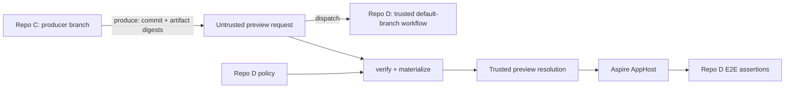

# Cross-repository module previews

Module previews let a developer in a producer repository run a consumer-owned E2E workflow against
the exact commit and immutable container images they have pushed. The .NET tool owns the generic
producer and consumer mechanics; each consumer retains a reviewed allowlist and its application-
specific test assertions.



The distinction between request and resolution is intentional:

- Repo C controls requested module commits, optional contract versions, and immutable OCI digests.
- Repo D controls whether a contract is required, allowed repositories and package IDs, the
  published package source or source fallback project, MSBuild properties, emitted environment
  variable names, allowed image repositories, and any additional repositories allowed to produce
  each image.
- `preview verify` is pure and offline. It does not clone repositories, run producer code, or contact
  a registry.
- `preview materialize` revalidates the request, performs only policy-approved work, hashes the
  resulting packages, verifies image digests remotely, and writes the trusted resolution consumed
  by the AppHost.

## Install the tool

Use a repository-local tool manifest so developers and CI use the same version:

```bash
dotnet new tool-manifest # only when .config/dotnet-tools.json does not exist
dotnet tool install Shirubasoft.Aspire.ModularAppHosts.Tool
dotnet tool restore
```

The installed command is `dotnet modular-apphosts`.

## Producer setup

Commit a `module-preview.producer.json` descriptor to Repo C. It describes what the producer may
offer; it contains no credentials, commands, build contexts, or consumer paths.

```json
{
  "schemaVersion": 1,
  "module": "module-c",
  "contract": {
    "packageId": "Acme.ModuleC.Contract"
  },
  "images": [
    {
      "resource": "module-c-api",
      "resourceKind": "container",
      "repository": "ghcr.io/acme/module-c/api",
      "required": true
    }
  ]
}
```

`resourceKind` is `project` when the module contract declares `AddProject(...).ExportAsContainer(...)`
and `container` when it declares `AddContainer(...)`.

### Generate the producer workflow

The tool can generate the producer-owned GitHub Actions workflow that builds and pushes the images,
turns their registry digests into a preview request, and waits for the trusted consumer workflow:

```bash
dotnet modular-apphosts preview workflow generate producer \
  --descriptor module-preview.producer.json \
  --apphost src/Producer.AppHost/Producer.AppHost.csproj \
  --output .github/workflows/module-preview.yml \
  --repo example/consumer-tests \
  --workflow module-preview-e2e.yml \
  --ref main \
  --aspire-version 13.4.6 \
  --tool-version 4.4.0 \
  --github-token-secret PREVIEW_AUTOMATION_TOKEN \
  --registry-auth-script .github/scripts/login-preview-registries.sh \
  --package-auth-script .github/scripts/login-package-feed.sh \
  --contract-publish-script .github/scripts/publish-preview-contract.sh \
  --secret REGISTRY_TOKEN=PREVIEW_REGISTRY_TOKEN \
  --secret PACKAGE_TOKEN=PREVIEW_PACKAGE_TOKEN
```

All paths embedded in the workflow are repository-relative. `--working-directory` changes where the
generator reads the descriptor without changing that checked-in path, which is useful to tools that
stage repository contents elsewhere. The output is deterministic for the same descriptor and
options, so commit it and review changes like other CI code.

Generation refuses to replace an existing file; pass `--force` only when intentionally regenerating
the checked-in workflow.

The generated workflow deliberately keeps authentication in producer-owned scripts. Secret
mappings have the form `<environment-name>=<GitHub-secret-name>` and are declared for
`workflow_call` as well as read during manual dispatch. `--github-token-secret` identifies the token
used by `gh` to dispatch and watch the consumer workflow; a normal repository `GITHUB_TOKEN`
generally cannot dispatch a different repository. When the configured registry explicitly accepts
anonymous writes, replace `--registry-auth-script` with `--anonymous-registry`. Public image reads
alone are not sufficient because this workflow pushes. Omit the package or publish script only when
the feed is public/already authenticated or the exact contract package has already been published.
Scripts receive the mapped secret environment variables plus `PREVIEW_ARTIFACTS_DIR`. Contract
scripts additionally receive `CONTRACT_VERSION`, and the publish script receives the same exact
version as its first argument.

At run time the workflow:

1. Checks out an explicit `source-ref` branch (or the current branch name), with full history, then
   verifies that `HEAD` is its pushed `origin` tip before publishing anything. Tags and commit IDs
   are rejected because `preview produce` requires an attached, pushed branch.
2. Writes every generated manifest and tool configuration below `${{ runner.temp }}`, keeping the
   producer worktree clean.
3. Installs Aspire CLI and Modular AppHosts into separate tool paths using a NuGet.org-only
   configuration and an isolated package cache. It does not use a multi-tool manifest.
4. Runs `aspire do describe-images`, selects the descriptor-owned effective resources, then runs
   `aspire do push`. The push pipeline builds each declared module image before pushing it.
5. Reads `module-images.json`, requires one build publisher and push target for every descriptor
   image, asks the registry for each pushed manifest digest, and derives the repository from the
   effective `pushReference` (including registry mappings). It passes that pushed repository and
   immutable digest to `preview produce` together with the exact contract version.
6. Runs `preview trigger --wait --github-output "$GITHUB_OUTPUT"`, exposes the consumer run ID and
   URL as reusable-workflow outputs, links the consumer run in the job summary, and uploads the
   generated preview documents for diagnosis.

The authentication and contract publishing scripts are intentionally application-specific. For
example, the registry script may use `docker login`, while the contract script may pack to
`$PREVIEW_ARTIFACTS_DIR` and publish to a private feed. The generator does not put registry hosts,
package feed URLs, credentials, or organization-specific actions into the workflow.

Build and push images in Repo C. Capture the registry-reported digest, not a tag. If the origin
workflow already built the image, pass that digest directly to the tool; Repo D does not rebuild it:

```bash
dotnet modular-apphosts preview produce \
  --descriptor module-preview.producer.json \
  --contract-version 2.3.0-preview.7 \
  --image module-c-api=ghcr.io/acme/module-c/api@sha256:0123456789abcdef0123456789abcdef0123456789abcdef0123456789abcdef \
  --output module-preview.json
```

The contract version may instead be committed as `contract.version` in the descriptor. Supplying
`--contract-version` overrides that value, which lets CI pass the exact version it just published.
A declared contract must get a version from one of those locations.

Omit `contract` entirely when the preview needs only already-built images:

```json
{
  "schemaVersion": 1,
  "module": "module-c",
  "images": [
    {
      "resource": "module-c-api",
      "resourceKind": "container",
      "repository": "ghcr.io/acme/module-c/api",
      "required": true
    }
  ]
}
```

That produces a request with an empty `contracts` collection. Do not pass `--contract-version` for
an image-only descriptor.

`produce` verifies that the worktree is clean, `HEAD` is attached to a branch, and the exact commit
is the pushed tip of that branch on `origin`. It rejects undeclared images, tags, uppercase or
abbreviated digests, missing required images, and mismatches between a supplied image repository
and the committed descriptor.

In GitHub Actions, check out an explicit branch ref so `HEAD` is attached, calculate the exact
contract version before packing, and write packages plus the generated manifest outside the Git
worktree, such as under `RUNNER_TEMP`. The exact version published by the job is the value passed to
`--contract-version`; a later or independently calculated version makes the request irreproducible.

Add changed dependencies explicitly; a branch name is never inferred across repositories:

```bash
dotnet modular-apphosts preview produce \
  --descriptor module-preview.producer.json \
  --contract-version 2.3.0-preview.7 \
  --pin module-a=https://github.com/acme/repo-a.git@0123456789abcdef0123456789abcdef01234567 \
  --image module-c-api=ghcr.io/acme/module-c/api@sha256:0123456789abcdef0123456789abcdef0123456789abcdef0123456789abcdef \
  --output module-preview.json
```

The request contains only reproducible identities. Package sources and source project paths are
absent because Repo C is not allowed to choose them for Repo D:

```json
{
  "schemaVersion": 1,
  "producer": {
    "repository": "https://github.com/acme/repo-c.git",
    "commit": "89abcdef0123456789abcdef0123456789abcdef",
    "dirty": false,
    "branch": "feat/some-work",
    "baseRef": "refs/heads/main",
    "baseCommit": "0123456789abcdef0123456789abcdef01234567"
  },
  "modules": [
    {
      "name": "module-c",
      "repository": "https://github.com/acme/repo-c.git",
      "commit": "89abcdef0123456789abcdef0123456789abcdef",
      "branch": "feat/some-work",
      "baseRef": "refs/heads/main",
      "baseCommit": "0123456789abcdef0123456789abcdef01234567"
    }
  ],
  "contracts": [
    {
      "module": "module-c",
      "packageId": "Acme.ModuleC.Contract",
      "version": "2.3.0-preview.7"
    }
  ],
  "images": [
    {
      "module": "module-c",
      "resource": "module-c-api",
      "resourceKind": "container",
      "repository": "ghcr.io/acme/module-c/api",
      "sha256": "sha256:0123456789abcdef0123456789abcdef0123456789abcdef0123456789abcdef"
    }
  ]
}
```

The producer branch and base ref are audit metadata. Consumers use only full immutable commits and
digests as artifact identities.

### Images built outside the module repository

An image-only producer may build a resource owned by a module in another repository. In that case,
use a pin with the same name as the descriptor's `module`; it replaces the default module selection
without changing the producer identity:

```bash
dotnet modular-apphosts preview produce \
  --descriptor module-preview.producer.json \
  --pin module-c=https://github.com/acme/module-owner.git@0123456789abcdef0123456789abcdef01234567 \
  --image module-c-api=ghcr.io/acme/module-c/api@sha256:0123456789abcdef0123456789abcdef0123456789abcdef0123456789abcdef \
  --output "$RUNNER_TEMP/module-preview.json"
```

Authorization is artifact-specific. A contract may be requested only when the producer repository
and commit match that contract module's selected repository and commit. When an image's selected
module does not match the producer, that image must independently authorize the producer's canonical
Git repository in the consumer policy:

```json
{
  "resource": "module-c-api",
  "resourceKind": "container",
  "repositories": [
    "ghcr.io/acme/module-c/api"
  ],
  "producerRepositories": [
    "https://github.com/acme/image-builder.git"
  ],
  "required": true
}
```

`producerRepositories` authorizes who may request that image override; it does not assert OCI build
provenance. Leave it empty or omit it when only the selected module repository may produce the
image. Selecting the producer repository as some other dependency grants no authority over the
contract or images of this module. A descriptor whose own module selection is overridden as above
is therefore image-only and must offer at least one immutable image.

## Consumer policy

Commit a policy such as `.github/module-preview-policy.json` to Repo D's default branch:

```json
{
  "schemaVersion": 1,
  "modules": [
    {
      "module": "module-c",
      "repository": "https://github.com/acme/repo-c.git",
      "contract": {
        "packageId": "Acme.ModuleC.Contract",
        "versionEnvironment": "ModuleCContractVersion",
        "required": false,
        "published": {
          "source": "https://api.nuget.org/v3/index.json"
        },
        "sourceFallback": {
          "enabled": false
        }
      },
      "images": [
        {
          "resource": "module-c-api",
          "resourceKind": "container",
          "repositories": [
            "ghcr.io/acme/module-c/api"
          ],
          "required": true
        }
      ]
    }
  ]
}
```

The contract policy's `required` value defaults to `true`. Set it to `false` only when Repo D permits
an image-only request; when the request omits the contract, no contract version or package feed is
exported. Image `required: true` independently prevents a producer from omitting a digest and making
the AppHost fall back to a source build.

`published.source` is the preferred contract materialization mode when Repo C already published the
package. It must be a consumer-reviewed, credential-free absolute HTTPS NuGet source without a query
or fragment. Keep credentials in Repo D's NuGet configuration or credential provider, never in the
source URL or preview documents.

Published resolution and an enabled source fallback are mutually exclusive. When a package is not
published, replace `published` with a reviewed fallback:

```json
{
  "sourceFallback": {
    "enabled": true,
    "project": "src/ModuleC.Contract/ModuleC.Contract.csproj"
  },
  "allowedPackProperties": [
    "ModularAppHostsVersion"
  ]
}
```

This fragment represents the corresponding fields inside `contract`. Source fallback permits fixed
`dotnet restore` and `dotnet pack` commands to execute MSBuild from the producer commit, so run it in
a no-secrets job. `allowedPackProperties` applies only to fallback mode and must be empty or omitted
in published mode. Every declared contract policy must enable exactly one materialization mode.
All transitive package dependencies of a published or fallback-built contract must already be
resolvable from consumer-approved NuGet sources. The preview protocol does not publish dependencies
or infer release order between independently owned packages.

## Verify and materialize in Repo D

Write the workflow input to a file without shell interpolation, then perform offline policy
verification before any producer code is fetched:

```bash
dotnet modular-apphosts preview verify \
  --manifest "$RUNNER_TEMP/module-preview.input.json" \
  --policy .github/module-preview-policy.json \
  --output "$RUNNER_TEMP/module-preview.verified.json"
```

After Repo D has prepared any consumer-owned package dependencies, materialize the request:

```bash
dotnet modular-apphosts preview materialize \
  --manifest "$RUNNER_TEMP/module-preview.verified.json" \
  --policy .github/module-preview-policy.json \
  --work-directory "$RUNNER_TEMP/module-preview-work" \
  --package-feed "$GITHUB_WORKSPACE/.preview-feed" \
  --resolution "$RUNNER_TEMP/module-preview.resolution.json" \
  --consumer-repository "https://github.com/acme/repo-d.git" \
  --consumer-commit "$GITHUB_SHA" \
  --nuget-config "$GITHUB_WORKSPACE/nuget.config" \
  --property ModularAppHostsVersion="$ModularAppHostsVersion" \
  --github-env "$GITHUB_ENV"
```

Materialization performs these operations:

1. Revalidates the strict request and consumer policy.
2. In published mode, restores the exact requested package ID and version with the consumer's NuGet
   configuration, then verifies NuGet's recorded source equals the policy-owned source and verifies
   the package bytes against NuGet's SHA-512 content hash. This permits separately trusted sources
   for transitive dependencies without allowing the requested contract to come from one of them. It
   does not fetch the producer repository or run `dotnet pack`.
3. In source fallback mode, fetches only the exact producer commit and runs fixed `dotnet restore`
   and `dotnet pack` commands against only the policy-owned project path.
4. Opens the resolved `.nupkg`, verifies its nuspec ID and version, records its SHA-256, and copies it
   into the package feed. Published contracts record both `source` and `packagePath` in the trusted
   resolution; fallback contracts record `packagePath` and a null `source`.
5. Verifies every `repository@sha256:...` with `docker buildx imagetools inspect`.
6. Writes the resolution and, when `--github-env` is used, exports `ModulePreview__Resolution`,
   `ModulePreview__PackageFeed`, and each policy-owned contract version environment variable.

`--package-feed` is required only when the request contains a contract. For an accepted image-only
request, omit `--package-feed`, `--nuget-config`, and contract pack properties:

```bash
dotnet modular-apphosts preview materialize \
  --manifest "$RUNNER_TEMP/module-preview.verified.json" \
  --policy .github/module-preview-policy.json \
  --work-directory "$RUNNER_TEMP/module-preview-work" \
  --resolution "$RUNNER_TEMP/module-preview.resolution.json" \
  --consumer-repository "https://github.com/acme/repo-d.git" \
  --consumer-commit "$GITHUB_SHA" \
  --github-env "$GITHUB_ENV"
```

The image-only GitHub environment contains `ModulePreview__Resolution`; it does not contain
`ModulePreview__PackageFeed` or a contract version variable.

The work directory must be empty. Authentication for Git, NuGet, and OCI registries is configured by
the workflow and never appears in the request, descriptor, policy, or resolution.
`--nuget-config` is passed to `dotnet restore` as `--configfile`, so NuGet uses only that file rather
than its normal configuration hierarchy. Include every required package source, source mapping, and
credential in that file. Omit `--nuget-config` to use NuGet's normal machine, user, and repository
configuration chain.
When source fallback fetches a private GitHub HTTPS repository, `materialize` uses the configured
`gh` executable as a process-scoped Git credential helper. Set `GH_TOKEN` or `GITHUB_TOKEN` for that
process, and use `--gh-executable <path>` only when `gh` is not on `PATH`. No global Git configuration
or credential-bearing repository URL is required.

## Apply the trusted resolution

Apply the resolution before importing a module:

```csharp
using Aspire.Hosting.ModularAppHosts;
using ModuleC.Contract;

var builder = DistributedApplication.CreateBuilder(args);

var resolutionPath = builder.Configuration["ModulePreview:Resolution"]
    ?? throw new InvalidOperationException("ModulePreview:Resolution is required.");
await builder.ApplyModulePreviewResolutionAsync(resolutionPath);

await builder.ImportModuleCModuleAsync();
await builder.Build().RunAsync();
```

The resolution makes image overrides authoritative. Projects run in container mode, module-declared
image publishing is disabled, and Aspire receives the repository plus native `WithImageSHA256(...)`
pin. The protocol keeps the canonical `sha256:<hex>` form; the adapter passes only `<hex>` to Aspire,
which adds the algorithm prefix when it constructs the image reference. A module whose resources are
all satisfied by immutable container images and whose factories do
not require repository content can start without a Repo C runtime checkout.

The resolution also records the canonical request hash, Repo D repository/commit, selected module
commits, resolved contract package hashes and local paths, and image digests. Upload it with the E2E
diagnostics.

## Dispatch the trusted workflow

From Repo C, dispatch the workflow definition from Repo D's trusted default branch:

```bash
dotnet modular-apphosts preview trigger \
  --manifest module-preview.json \
  --repo acme/repo-d \
  --workflow module-preview-e2e.yml \
  --ref main \
  --wait \
  --github-output "$GITHUB_OUTPUT"
```

The default workflow input is `manifest_json`. Use `--input-name` for another declared input and
repeat `--input name=value` for consumer-specific metadata. `--ref` selects Repo D's workflow
definition; keep it fixed to a trusted branch. It is deliberately unrelated to Repo C's feature
branch.

On a successful dispatch, `trigger` prints the run identity as GitHub-style output:

```text
workflow_run_id=123456789
workflow_run_url=https://github.com/acme/repo-d/actions/runs/123456789
```

`--github-output <path>` appends the same two values to that file. A bare `--wait` watches the
returned run with `gh run watch --exit-status`, so the trigger process exits unsuccessfully when the
consumer workflow fails. Omit `--wait` when Repo C only needs to enqueue the run and retain its URL.

For local use, authenticate with `gh auth login`. A normal repository-scoped `GITHUB_TOKEN` in Repo C
cannot dispatch Repo D. For unattended dispatch, use a GitHub App installed only on the necessary
repositories with Actions write permission on Repo D and Contents read permission on selected
producer repositories.

## Legacy source-only export

`preview export --module <name> --output <path>` remains available for source-only requests that do
not use a producer descriptor, contracts, or images. `--dependency` is an alias for `--pin`. Apply
such a request with `ApplyModulePreviewManifestAsync`; it selects exact source commits but does not
cross the consumer policy/materialization boundary and cannot consume prebuilt artifacts.

## Complete fixture

The runnable fixture is split across:

- [`Shirubasoft/aspire-modular-apphosts-preview-producer`](https://github.com/Shirubasoft/aspire-modular-apphosts-preview-producer), which owns the contract, API image build, descriptor, and immutable digest; and
- [`Shirubasoft/aspire-modular-apphosts-preview-consumer`](https://github.com/Shirubasoft/aspire-modular-apphosts-preview-consumer), which owns the policy, trusted workflow, AppHost, and assertions.

The producer publishes its changed API container once. The consumer tool verifies and applies that
digest, waits for the API and preview-only sidecar with the Aspire CLI, asserts the feature response,
and uploads the trusted resolution and diagnostics.

## Failure modes

| Failure | Meaning | Resolution |
| --- | --- | --- |
| Dirty or unpushed producer worktree | CI cannot reproduce all runnable content | Commit and push the exact branch tip |
| Declared contract has no exact version | The request cannot identify a reproducible package | Commit `contract.version` or pass `--contract-version` |
| Required contract omitted | Repo D does not allow an image-only request for that module | Include the contract or review the policy and set contract `required` to `false` |
| Missing required image | The request could fall back to building source | Publish the image and pass its immutable digest |
| Unauthorized repository or resource | Repo C attempted to widen Repo D's trust boundary | Review and update Repo D's policy, not the request |
| Unauthorized external image producer | An image's policy does not allow the request producer repository | Add the canonical repository to that image's reviewed `producerRepositories`, or produce it from the selected module repository |
| Contract identity mismatch | The restored or packed nuspec differs from the request | Fix the published package or producer package ID/version |
| Published contract resolution fails | The exact version is absent, inaccessible, or NuGet authentication is missing | Publish or grant access to the exact version, then retry |
| Image inspect failure | The digest is absent, inaccessible, or authentication is missing | Publish/grant access, then retry the same digest |
| No contract materialization mode | Repo D has no approved way to obtain the requested contract | Configure a reviewed published source or enable a no-secrets fallback |
| AppHost requests a repository despite complete image pins | The contract has a repository-backed generic factory or an unpinned project | Pin every runtime image or retain the exact checkout |
| Dispatch denied | The caller cannot start Repo D's workflow | Authenticate with a narrowly scoped GitHub App or user token |
| Watched run fails | Repo D's workflow completed unsuccessfully | Follow `workflow_run_url` and inspect the consumer-owned diagnostics |
