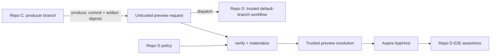

# Cross-repository module previews

Module previews let a developer in a producer repository run a consumer-owned E2E workflow against
the exact commit and immutable container images they have pushed. The .NET tool owns the generic
producer and consumer mechanics; each consumer retains a reviewed allowlist and its application-
specific test assertions.



The distinction between request and resolution is intentional:

- Repo C controls requested module commits, contract versions, and immutable OCI digests.
- Repo D controls allowed repositories, package IDs, source fallback project paths, MSBuild
  properties, emitted environment variable names, and allowed image repositories.
- `preview verify` is pure and offline. It does not clone repositories, run producer code, or contact
  a registry.
- `preview materialize` revalidates the request, performs only policy-approved work, hashes the
  resulting packages, verifies image digests remotely, and writes the trusted resolution consumed
  by the AppHost.

## Install the tool

Use a repository-local tool manifest so developers and CI use the same version:

```bash
dotnet new tool-manifest # only when .config/dotnet-tools.json does not exist
dotnet tool install Shirubasoft.Aspire.ModularAppHosts.Tool
dotnet tool restore
```

The installed command is `dotnet modular-apphosts`.

## Producer setup

Commit a `module-preview.producer.json` descriptor to Repo C. It describes what the producer may
offer; it contains no credentials, commands, build contexts, or consumer paths.

```json
{
  "schemaVersion": 1,
  "module": "module-c",
  "contract": {
    "packageId": "Acme.ModuleC.Contract",
    "version": "2.3.0-preview.7"
  },
  "images": [
    {
      "resource": "module-c-api",
      "resourceKind": "container",
      "repository": "ghcr.io/acme/module-c/api",
      "required": true
    }
  ]
}
```

`resourceKind` is `project` when the module contract declares `AddProject(...).ExportAsContainer(...)`
and `container` when it declares `AddContainer(...)`.

Build and push images in Repo C. Capture the registry-reported digest, not a tag. If the origin
workflow already built the image, pass that digest directly to the tool; Repo D does not rebuild it:

```bash
dotnet modular-apphosts preview produce \
  --descriptor module-preview.producer.json \
  --image module-c-api=ghcr.io/acme/module-c/api@sha256:0123456789abcdef0123456789abcdef0123456789abcdef0123456789abcdef \
  --output module-preview.json
```

`produce` verifies that the worktree is clean, `HEAD` is attached to a branch, and the exact commit
is the pushed tip of that branch on `origin`. It rejects undeclared images, tags, uppercase or
abbreviated digests, missing required images, and mismatches between a supplied image repository
and the committed descriptor.

Add changed dependencies explicitly; a branch name is never inferred across repositories:

```bash
dotnet modular-apphosts preview produce \
  --descriptor module-preview.producer.json \
  --pin module-a=https://github.com/acme/repo-a.git@0123456789abcdef0123456789abcdef01234567 \
  --image module-c-api=ghcr.io/acme/module-c/api@sha256:0123456789abcdef0123456789abcdef0123456789abcdef0123456789abcdef \
  --output module-preview.json
```

The request contains only reproducible identities. Package sources and source project paths are
absent because Repo C is not allowed to choose them for Repo D:

```json
{
  "schemaVersion": 1,
  "producer": {
    "repository": "https://github.com/acme/repo-c.git",
    "commit": "89abcdef0123456789abcdef0123456789abcdef",
    "dirty": false,
    "branch": "feat/some-work",
    "baseRef": "refs/heads/main",
    "baseCommit": "0123456789abcdef0123456789abcdef01234567"
  },
  "modules": [
    {
      "name": "module-c",
      "repository": "https://github.com/acme/repo-c.git",
      "commit": "89abcdef0123456789abcdef0123456789abcdef",
      "branch": "feat/some-work",
      "baseRef": "refs/heads/main",
      "baseCommit": "0123456789abcdef0123456789abcdef01234567"
    }
  ],
  "contracts": [
    {
      "module": "module-c",
      "packageId": "Acme.ModuleC.Contract",
      "version": "2.3.0-preview.7"
    }
  ],
  "images": [
    {
      "module": "module-c",
      "resource": "module-c-api",
      "resourceKind": "container",
      "repository": "ghcr.io/acme/module-c/api",
      "sha256": "sha256:0123456789abcdef0123456789abcdef0123456789abcdef0123456789abcdef"
    }
  ]
}
```

The producer branch and base ref are audit metadata. Consumers use only full immutable commits and
digests as artifact identities.

## Consumer policy

Commit a policy such as `.github/module-preview-policy.json` to Repo D's default branch:

```json
{
  "schemaVersion": 1,
  "modules": [
    {
      "module": "module-c",
      "repository": "https://github.com/acme/repo-c.git",
      "contract": {
        "packageId": "Acme.ModuleC.Contract",
        "versionEnvironment": "ModuleCContractVersion",
        "sourceFallback": {
          "enabled": true,
          "project": "src/ModuleC.Contract/ModuleC.Contract.csproj"
        },
        "allowedPackProperties": [
          "ModularAppHostsVersion"
        ]
      },
      "images": [
        {
          "resource": "module-c-api",
          "resourceKind": "container",
          "repositories": [
            "ghcr.io/acme/module-c/api"
          ],
          "required": true
        }
      ]
    }
  ]
}
```

`required: true` prevents a producer from omitting the digest and making the AppHost fall back to a
source build. A source fallback is useful until the producer publishes its contract package, but it
allows `dotnet restore` and `dotnet pack` to execute MSBuild from the producer commit. Run that step
in a no-secrets job. Disable `sourceFallback` once the contract is available through a separately
trusted package-materialization path.

## Verify and materialize in Repo D

Write the workflow input to a file without shell interpolation, then perform offline policy
verification before any producer code is fetched:

```bash
dotnet modular-apphosts preview verify \
  --manifest "$RUNNER_TEMP/module-preview.input.json" \
  --policy .github/module-preview-policy.json \
  --output "$RUNNER_TEMP/module-preview.verified.json"
```

After Repo D has prepared any consumer-owned package dependencies, materialize the request:

```bash
dotnet modular-apphosts preview materialize \
  --manifest "$RUNNER_TEMP/module-preview.verified.json" \
  --policy .github/module-preview-policy.json \
  --work-directory "$RUNNER_TEMP/module-preview-work" \
  --package-feed "$GITHUB_WORKSPACE/.preview-feed" \
  --resolution "$RUNNER_TEMP/module-preview.resolution.json" \
  --consumer-repository "https://github.com/acme/repo-d.git" \
  --consumer-commit "$GITHUB_SHA" \
  --nuget-config "$GITHUB_WORKSPACE/nuget.config" \
  --property ModularAppHostsVersion="$ModularAppHostsVersion" \
  --github-env "$GITHUB_ENV"
```

Materialization performs these operations:

1. Revalidates the strict request and consumer policy.
2. Fetches only each exact contract-source commit when source fallback is enabled.
3. Runs fixed `dotnet restore` and `dotnet pack` commands against only the policy-owned project path.
4. Opens the resulting `.nupkg`, verifies its nuspec ID and version, and records its SHA-256.
5. Verifies every `repository@sha256:...` with `docker buildx imagetools inspect`.
6. Writes the resolution and, when `--github-env` is used, exports `ModulePreview__Resolution`,
   `ModulePreview__PackageFeed`, and each policy-owned contract version environment variable.

The work directory must be empty. Authentication for Git, NuGet, and OCI registries is configured by
the workflow and never appears in the request, descriptor, policy, or resolution.

## Apply the trusted resolution

Apply the resolution before importing a module:

```csharp
using Aspire.Hosting.ModularAppHosts;
using ModuleC.Contract;

var builder = DistributedApplication.CreateBuilder(args);

var resolutionPath = builder.Configuration["ModulePreview:Resolution"]
    ?? throw new InvalidOperationException("ModulePreview:Resolution is required.");
await builder.ApplyModulePreviewResolutionAsync(resolutionPath);

await ModuleCModule.ImportModuleAsync(builder);
await builder.Build().RunAsync();
```

The resolution makes image overrides authoritative. Projects run in container mode, module-declared
image publishing is disabled, and Aspire receives the repository plus native `WithImageSHA256(...)`
pin. The protocol keeps the canonical `sha256:<hex>` form; the adapter passes only `<hex>` to Aspire,
which adds the algorithm prefix when it constructs the image reference. A module whose resources are
all satisfied by immutable container images and whose factories do
not require repository content can start without a Repo C runtime checkout.

The resolution also records the canonical request hash, Repo D repository/commit, selected module
commits, resolved contract package hashes and local paths, and image digests. Upload it with the E2E
diagnostics.

## Dispatch the trusted workflow

From Repo C, dispatch the workflow definition from Repo D's trusted default branch:

```bash
dotnet modular-apphosts preview trigger \
  --manifest module-preview.json \
  --repo acme/repo-d \
  --workflow module-preview-e2e.yml \
  --ref main
```

The default workflow input is `manifest_json`. Use `--input-name` for another declared input and
repeat `--input name=value` for consumer-specific metadata. `--ref` selects Repo D's workflow
definition; keep it fixed to a trusted branch. It is deliberately unrelated to Repo C's feature
branch.

For local use, authenticate with `gh auth login`. A normal repository-scoped `GITHUB_TOKEN` in Repo C
cannot dispatch Repo D. For unattended dispatch, use a GitHub App installed only on the necessary
repositories with Actions write permission on Repo D and Contents read permission on selected
producer repositories.

## Legacy source-only export

`preview export --module <name> --output <path>` remains available for source-only requests that do
not use a producer descriptor, contracts, or images. `--dependency` is an alias for `--pin`. Apply
such a request with `ApplyModulePreviewManifestAsync`; it selects exact source commits but does not
cross the consumer policy/materialization boundary and cannot consume prebuilt artifacts.

## Complete fixture

The runnable fixture is split across:

- [`Shirubasoft/aspire-modular-apphosts-preview-producer`](https://github.com/Shirubasoft/aspire-modular-apphosts-preview-producer), which owns the contract, API image build, descriptor, and immutable digest; and
- [`Shirubasoft/aspire-modular-apphosts-preview-consumer`](https://github.com/Shirubasoft/aspire-modular-apphosts-preview-consumer), which owns the policy, trusted workflow, AppHost, and assertions.

The producer publishes its changed API container once. The consumer tool verifies and applies that
digest, waits for the API and preview-only sidecar with the Aspire CLI, asserts the feature response,
and uploads the trusted resolution and diagnostics.

## Failure modes

| Failure | Meaning | Resolution |
| --- | --- | --- |
| Dirty or unpushed producer worktree | CI cannot reproduce all runnable content | Commit and push the exact branch tip |
| Missing required image | The request could fall back to building source | Publish the image and pass its immutable digest |
| Unauthorized repository or resource | Repo C attempted to widen Repo D's trust boundary | Review and update Repo D's policy, not the request |
| Contract identity mismatch | The packed nuspec differs from the request | Fix the producer package ID/version or descriptor |
| Image inspect failure | The digest is absent, inaccessible, or authentication is missing | Publish/grant access, then retry the same digest |
| Source fallback disabled | Repo D has no approved way to obtain the requested contract | Publish the contract through a trusted path or enable a reviewed no-secrets fallback |
| AppHost requests a repository despite complete image pins | The contract has a repository-backed generic factory or an unpinned project | Pin every runtime image or retain the exact checkout |
| Dispatch denied | The caller cannot start Repo D's workflow | Authenticate with a narrowly scoped GitHub App or user token |
